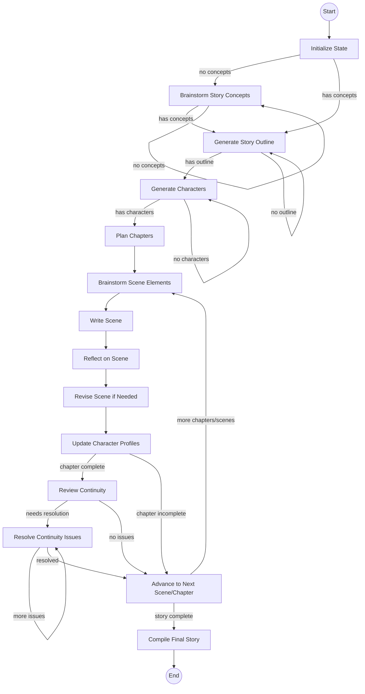

# StoryCraft Agent

An autonomous AI agent designed to write engaging, multi-chapter stories based on the hero's journey using LangGraph for orchestration and LangMem for memory management.

## Features

- **Hero's Journey Integration**: Dynamically generates all phases of the hero's journey as high-level plot milestones
- **Autonomous Storyline Generation**: Creates a granular storyline subdivided into chapters and scenes
- **Multi-Character Management**: Tracks each character's backstory, evolution, relationships, and knowledge
- **Iterative Self-Reflection & Revision**: Each chapter and scene undergoes a self-reflection process for quality
- **Continuity & Reader Engagement**: Flags inconsistencies and controls the timing of key plot revelations
- **Creative Brainstorming**: Generates multiple creative ideas and evaluates them to enhance story elements
- **Author Style Emulation**: Analyzes and mimics the writing style of specified authors
- **Real-time Progress Tracking**: Provides detailed progress updates at each step of the generation process
- **Robust Error Handling**: Includes safety mechanisms to prevent infinite loops and gracefully handle edge cases
- **LLM Response Caching**: Improves performance and reduces API costs by caching LLM responses
- **Multi-language Support**: Generate stories in 12 different languages

## Requirements

- Python 3.8+
- At least one of the following API keys:
  - Google Gemini API key
  - OpenAI API key
  - Anthropic API key

## Installation

1. Clone this repository
2. Install dependencies:
   ```
   pip install -r requirements.txt
   ```
3. Create a `.env` file in the project root:
   ```
   cp .env.example .env
   ```
4. Edit the `.env` file and add your API key(s)
   ```
   GEMINI_API_KEY=your_gemini_api_key_here
   OPENAI_API_KEY=your_openai_api_key_here
   ANTHROPIC_API_KEY=your_anthropic_api_key_here
   
   # Optional: Set your default model provider
   DEFAULT_MODEL_PROVIDER=gemini
   ```

## Usage

Run the story generation script:

```bash
python run_storyteller.py --genre fantasy --tone epic --output my_story.md
```

### Options

- `--genre`: The genre of the story (e.g., fantasy, sci-fi, mystery)
- `--tone`: The tone of the story (e.g., epic, dark, humorous)
- `--author`: Author whose style to emulate (e.g., Tolkien, Rowling, Martin)
- `--language`: Target language for story generation (default: english)
- `--idea`: Initial story idea to use as a starting point (e.g., 'A detective story set in a zoo')
- `--output`: Output file to save the generated story
- `--verbose`: Display detailed information about the story elements as they're generated
- `--cache`: LLM cache type to use (choices: memory, sqlite, none; default: sqlite)
- `--cache-path`: Path to the cache file (for sqlite cache)
- `--recursion-limit`: LangGraph recursion limit for complex stories (default: 200)
- `--model-provider`: LLM provider to use (choices: openai, anthropic, gemini; default: gemini)
- `--model`: Specific model to use (defaults to provider's default model)

### Supported Languages

The system supports generating stories in the following languages:
- English (default)
- Spanish
- French
- German
- Italian
- Portuguese
- Russian
- Japanese
- Chinese
- Korean
- Arabic
- Hindi

### Examples

```bash
# Generate a fantasy story in an epic tone
python run_storyteller.py --genre fantasy --tone epic

# Generate a mystery story in a dark tone inspired by Edgar Allan Poe
python run_storyteller.py --genre mystery --tone dark --author "Edgar Allan Poe"

# Generate a sci-fi story in the style of Isaac Asimov and save to a custom file
python run_storyteller.py --genre "science fiction" --tone philosophical --author "Isaac Asimov" --output asimov_story.md

# Generate a story with detailed progress updates and in-memory caching
python run_storyteller.py --genre fantasy --tone epic --verbose --cache memory

# Generate a story with no LLM caching (useful for testing or when you want fresh responses)
python run_storyteller.py --genre mystery --tone suspenseful --cache none

# Use a custom cache location
python run_storyteller.py --genre fantasy --tone heroic --cache sqlite --cache-path ~/.cache/storyteller/my_custom_cache.db

# Generate a complex story with higher recursion limit for large number of chapters
python run_storyteller.py --genre fantasy --tone epic --recursion-limit 300

# Generate a story in Spanish
python run_storyteller.py --genre fantasy --tone epic --language spanish

# Generate a story based on a specific idea
python run_storyteller.py --idea "A detective story set in a zoo" --tone mysterious

# Generate a story using OpenAI's GPT-4o model
python run_storyteller.py --genre fantasy --tone epic --model-provider openai

# Generate a story using Anthropic's Claude 3.5 Sonnet model
python run_storyteller.py --genre mystery --tone dark --model-provider anthropic

# Generate a story using a specific model from Google
python run_storyteller.py --genre sci-fi --tone futuristic --model-provider gemini --model gemini-2.0-pro
```

## How It Works

StoryCraft uses LangGraph to orchestrate the story generation process through several stages:

1. **Initialization**: Sets up the story parameters based on user input
2. **Creative Brainstorming**: Generates and evaluates multiple creative story concepts
3. **Story Outline Generation**: Creates the overall hero's journey structure
4. **Character Development**: Generates detailed character profiles
5. **Chapter Planning**: Divides the story into chapters with outlines
6. **Scene Brainstorming**: Generates creative elements for each scene
7. **Scene Writing**: Generates detailed content for each scene
8. **Reflection & Revision**: Reviews scenes for quality and consistency
9. **Character Updates**: Manages character evolution throughout the story
10. **Story Compilation**: Assembles the final complete story

The agent maintains state throughout the process using LangGraph's state management and uses LangMem for memory operations to ensure consistency and continuity.

## System Components

### Plot Thread Tracking

The plot tracking system manages narrative threads throughout the story generation process:

1. **Thread Identification**:
   - After each scene is written, the system analyzes it to identify plot threads
   - Uses LLM with structured output to extract thread information
   - Recognizes various types of threads: mysteries, quests, relationships, conflicts, secrets

2. **Thread Management**:
   - `PlotThread` class represents individual threads with properties like name, description, importance, and status
   - `PlotThreadRegistry` maintains all threads and provides filtering methods
   - Threads have statuses (INTRODUCED, DEVELOPED, RESOLVED, ABANDONED) and importance levels (MAJOR, MINOR, BACKGROUND)

3. **Thread Integration**:
   - When writing new scenes, the system provides guidance on active threads that need attention
   - Major threads must be addressed, minor threads should be addressed if relevant
   - At story completion, the system verifies all major threads are resolved

### Scene Generation

The scene generation process combines creativity with structural coherence:

1. **Brainstorming**:
   - `brainstorm_scene_elements` generates creative elements and potential surprises
   - Evaluates ideas based on criteria like visual impact, character development, and plot advancement

2. **Writing**:
   - `write_scene` uses comprehensive context including plot threads, character information, and worldbuilding
   - Incorporates author style, language considerations, and emotional guidance
   - Ensures scene serves both character and plot development

3. **Reflection & Revision**:
   - `reflect_on_scene` evaluates the scene against quality criteria
   - `revise_scene_if_needed` addresses identified issues
   - Ensures consistency with established world elements and character traits

### Character Management

Characters evolve dynamically throughout the story:

1. **Profile Creation**:
   - Generates detailed character profiles with backstory, motivations, and traits
   - Establishes relationships between characters
   - Defines inner conflicts and character arcs

2. **Knowledge Tracking**:
   - Maintains what each character knows at any point in the story
   - Prevents knowledge inconsistencies (characters knowing things they shouldn't)

3. **Profile Updates**:
   - After each scene, character profiles are updated to reflect developments
   - Tracks character growth, relationship changes, and new knowledge

### Worldbuilding System

The worldbuilding system creates and maintains a consistent story world:

1. **Element Generation**:
   - Creates detailed world elements across categories (geography, politics, culture, etc.)
   - Tailors elements to the story's genre and tone

2. **Scene Integration**:
   - Identifies which world elements are relevant to each scene
   - Provides worldbuilding guidance to ensure consistency

3. **Dynamic Updates**:
   - World elements evolve as the story progresses
   - New locations, cultural details, and world rules can be added organically

### Consistency Management

The system maintains narrative consistency through several mechanisms:

1. **Continuity Review**:
   - After each chapter, reviews for continuity issues
   - Identifies plot holes, character inconsistencies, and worldbuilding contradictions

2. **Issue Resolution**:
   - Resolves identified issues through targeted revisions
   - Updates relevant state elements to maintain consistency

3. **Memory Integration**:
   - Uses LangMem to store and retrieve important story elements
   - Creates memory anchors for critical elements that must be preserved

## Architecture

The agent is built using:

- **LangGraph**: For orchestration and state management
- **LangMem**: For memory and reflection capabilities
- **Multiple LLM Providers**: Support for OpenAI, Anthropic, and Google Gemini models
- **LangChain Caching**: For improved performance and cost efficiency

The architecture follows a graph structure with nodes for each step of the story generation process, connected by conditional edges that determine the flow based on the current state.

### Model Interchangeability

The system supports multiple LLM providers that can be selected at runtime:

- **OpenAI**: GPT-4o and other OpenAI models
- **Anthropic**: Claude 3.5 Sonnet and other Claude models
- **Google Gemini**: Gemini 2.0 Flash (default) and other Gemini models

Each provider has its own default model, but specific models can be specified using the `--model` parameter. The system will automatically use the appropriate API key from the .env file based on the selected provider.

### Core Modules

1. **Initialization (`initialization.py`)**:
   - Sets up initial state based on user parameters
   - Generates author style guidance if an author is specified
   - Initializes memory with key constraints and requirements

2. **Outline Generation (`outline.py`)**:
   - Creates the global story structure following the hero's journey
   - Generates character profiles with backstories and motivations
   - Plans chapters with scene breakdowns

3. **Worldbuilding (`worldbuilding.py`)**:
   - Generates detailed world elements across multiple categories
   - Creates geography, politics, culture, history, and more
   - Ensures world elements align with genre conventions

4. **Scene Management (`scenes.py`)**:
   - Handles scene brainstorming, writing, reflection, and revision
   - Integrates plot threads, character information, and world elements
   - Ensures scenes advance both character arcs and plot development

5. **Plot Thread Tracking (`plot_threads.py`)**:
   - Identifies and manages narrative threads throughout the story
   - Tracks thread status (introduced, developed, resolved, abandoned)
   - Ensures major plot threads are properly resolved

6. **Progression Management (`progression.py`)**:
   - Handles transitions between scenes and chapters
   - Updates character profiles and world elements
   - Reviews continuity and resolves issues

7. **Graph Construction (`graph.py`)**:
   - Defines the LangGraph workflow with nodes and conditional edges
   - Implements decision functions that determine the flow
   - Manages state transitions between components

8. **Storyteller Core (`storyteller.py`)**:
   - Provides the main entry point for story generation
   - Handles initial idea parsing and genre element extraction
   - Manages memory anchors for critical story elements

## LangGraph Workflow



The diagram shows the current LangGraph implementation with explicit conditional edges between nodes. Unlike earlier versions that used a central router, this version uses LangGraph's native edge system for state transitions. Each conditional edge evaluates the current state to determine the next node to execute, creating a more reliable and maintainable flow that prevents recursion issues.

## State Management

The agent uses a structured state schema with TypedDict classes to manage the evolving state of the story:

- **StoryState**: The top-level state container
- **CharacterProfile**: Tracks character information and development
- **ChapterState**: Manages chapter outlines and scenes
- **SceneState**: Contains scene content and reflection notes

State updates follow LangGraph's immutable state update pattern:
1. Only the changed keys are returned from node functions
2. The state is never modified directly
3. Nested structures are copied before modification
4. LangGraph handles merging the changes into the state


## Component Interactions

### Plot Tracking Integration with Story Flow

The plot tracking system interacts with other components throughout the story generation process:

1. **Scene Generation Integration**:
   - Before writing a scene, the system retrieves active plot threads using `get_active_plot_threads_for_scene`
   - These threads are incorporated into the scene writing prompt via `_prepare_plot_thread_guidance`
   - This ensures the writer is aware of which threads need development or resolution

2. **State Management Integration**:
   - After a scene is written, `update_plot_threads` analyzes the scene and updates the thread registry
   - The updated registry is stored in the state and passed to subsequent nodes
   - This creates a feedback loop where each scene influences future scenes

3. **Continuity Review Integration**:
   - During continuity review, `check_plot_thread_resolution` verifies all major threads are resolved
   - Unresolved threads are flagged as continuity issues that need resolution
   - This prevents the story from ending with unresolved major plot elements

4. **Story Compilation Integration**:
   - Before final compilation, a final check ensures all major threads are resolved
   - This provides a safeguard against plot holes in the finished story

This integrated approach ensures that plot threads are not just tracked passively but actively influence the story generation process at multiple points, creating a coherent narrative with properly developed and resolved plot elements.

