# StoryCraft Agent

An autonomous AI agent designed to write engaging, multi-chapter stories based on the hero's journey using LangGraph for orchestration and LangMem for memory management.

## Features

- **Hero's Journey Integration**: Dynamically generates all phases of the hero's journey as high-level plot milestones
- **Autonomous Storyline Generation**: Creates a granular storyline subdivided into chapters and scenes
- **Multi-Character Management**: Tracks each character's backstory, evolution, relationships, and knowledge
- **Iterative Self-Reflection & Revision**: Each chapter and scene undergoes a self-reflection process for quality
- **Continuity & Reader Engagement**: Flags inconsistencies and controls the timing of key plot revelations
- **Creative Brainstorming**: Generates multiple creative ideas and evaluates them to enhance story elements
- **Author Style Emulation**: Analyzes and mimics the writing style of specified authors
- **Real-time Progress Tracking**: Provides detailed progress updates at each step of the generation process
- **Robust Error Handling**: Includes safety mechanisms to prevent infinite loops and gracefully handle edge cases

## Requirements

- Python 3.8+
- Anthropic API key

## Installation

1. Clone this repository
2. Install dependencies:
   ```
   pip install -r requirements.txt
   ```
3. Create a `.env` file in the project root:
   ```
   cp .env.example .env
   ```
4. Edit the `.env` file and add your Anthropic and OpenAI API keys
   ```
   ANTHROPIC_API_KEY=sk_ant_your_key_here
   OPENAI_API_KEY=sk-your_key_here  # For embeddings
   ```

## Usage

Run the story generation script:

```bash
python run_storyteller.py --genre fantasy --tone epic --output my_story.md
```

### Options

- `--genre`: The genre of the story (e.g., fantasy, sci-fi, mystery)
- `--tone`: The tone of the story (e.g., epic, dark, humorous)
- `--author`: Author whose style to emulate (e.g., Tolkien, Rowling, Martin)
- `--output`: Output file to save the generated story

### Examples

```bash
# Generate a fantasy story in an epic tone
python run_storyteller.py --genre fantasy --tone epic

# Generate a mystery story in a dark tone inspired by Edgar Allan Poe
python run_storyteller.py --genre mystery --tone dark --author "Edgar Allan Poe"

# Generate a sci-fi story in the style of Isaac Asimov and save to a custom file
python run_storyteller.py --genre "science fiction" --tone philosophical --author "Isaac Asimov" --output asimov_story.md
```

## How It Works

StoryCraft uses LangGraph to orchestrate the story generation process through several stages:

1. **Initialization**: Sets up the story parameters based on user input
2. **Creative Brainstorming**: Generates and evaluates multiple creative story concepts
3. **Story Outline Generation**: Creates the overall hero's journey structure
4. **Character Development**: Generates detailed character profiles
5. **Chapter Planning**: Divides the story into chapters with outlines
6. **Scene Brainstorming**: Generates creative elements for each scene
7. **Scene Writing**: Generates detailed content for each scene
8. **Reflection & Revision**: Reviews scenes for quality and consistency
9. **Character Updates**: Manages character evolution throughout the story
10. **Story Compilation**: Assembles the final complete story

The agent maintains state throughout the process using LangGraph's state management and uses LangMem for memory operations to ensure consistency and continuity.

## Architecture

The agent is built using:

- **LangGraph**: For orchestration and state management
- **LangMem**: For memory and reflection capabilities
- **Claude 3.5 Sonnet**: For high-quality text generation

The architecture follows a graph structure with nodes for each step of the story generation process, connected by conditional edges that determine the flow based on the current state.

## LangGraph Workflow

```mermaid
flowchart TD
    START((Start)) --> INIT[Initialize State]
    INIT --> ROUTER{Router}
    
    ROUTER -->|If no story outline| BRAINSTORM[Brainstorm Story Concepts]
    BRAINSTORM --> ROUTER
    
    ROUTER -->|If outline needed| OUTLINE[Generate Story Outline]
    OUTLINE --> ROUTER
    
    ROUTER -->|If no characters| CHARS[Generate Characters]
    CHARS --> ROUTER
    
    ROUTER -->|If no chapters| PLAN[Plan Chapters]
    PLAN --> ROUTER
    
    ROUTER -->|If scene needs creative elements| SCENE_BRAINSTORM[Brainstorm Scene Elements]
    SCENE_BRAINSTORM --> ROUTER
    
    ROUTER -->|If scene needs to be written| WRITE[Write Scene]
    WRITE --> ROUTER
    
    ROUTER -->|If scene needs reflection| REFLECT[Reflect on Scene]
    REFLECT --> REVISE[Revise Scene if Needed]
    REVISE --> ROUTER
    
    ROUTER -->|After reflection| UPDATE_CHARS[Update Character Profiles]
    UPDATE_CHARS --> ROUTER
    
    ROUTER -->|If chapter complete| REVIEW[Review Continuity]
    REVIEW --> ROUTER
    
    ROUTER -->|Move to next scene/chapter| ADVANCE[Advance to Next Scene/Chapter]
    ADVANCE --> ROUTER
    
    ROUTER -->|If story complete| COMPILE[Compile Final Story]
    COMPILE --> END((End))
    
    subgraph Safety Mechanisms
        ROUTER -->|If router called too many times| END
        ROUTER -->|If invalid state detected| COMPILE
    end
```



The diagram shows the current LangGraph implementation with a central router that manages the flow between all nodes based on the current state. Each node reports progress as it executes via decorators, allowing for real-time tracking of the story generation process. The router directs the flow to the appropriate next node, and includes built-in safety mechanisms to prevent infinite recursion and handle error cases gracefully.

## State Management

The agent uses a structured state schema with TypedDict classes to manage the evolving state of the story:

- **StoryState**: The top-level state container
- **CharacterProfile**: Tracks character information and development
- **ChapterState**: Manages chapter outlines and scenes
- **SceneState**: Contains scene content and reflection notes

State updates are handled through LangGraph's reducer functions, which provide controlled ways to merge new information into the existing state.

## Progress Tracking

The system includes detailed progress tracking through every step of the story generation process:

- **Decorator-based Tracking**: Node functions are wrapped with decorators that report execution progress
- **Real-time Status Updates**: Shows which node is currently executing and its completion status
- **Detailed Progress Reporting**: Provides context-specific information for each step (brainstorming, writing, reflection)
- **Percentage Completion**: Calculates and displays overall progress through chapters and scenes
- **Error Handling**: Gracefully handles errors and provides meaningful error messages
- **Safety Mechanisms**: Prevents infinite recursion loops with circuit breakers and fallbacks

Progress tracking is implemented using a module-level tracking system that integrates with LangGraph's execution model without modifying its core functionality.
