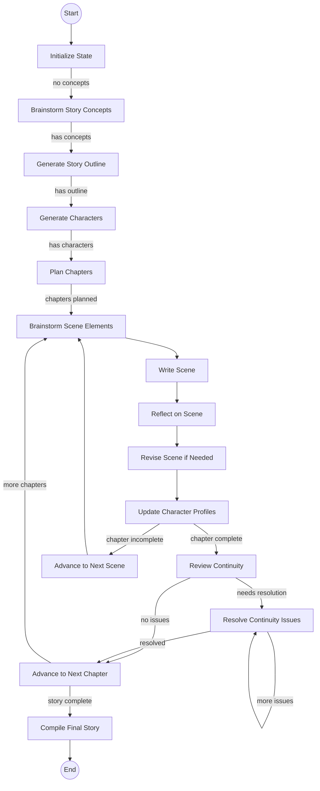

# StoryCraft Agent

An autonomous AI agent designed to write engaging, multi-chapter stories based on the hero's journey using LangGraph for orchestration and LangMem for memory management.

## Features

- **Hero's Journey Integration**: Dynamically generates all phases of the hero's journey as high-level plot milestones
- **Autonomous Storyline Generation**: Creates a granular storyline subdivided into chapters and scenes
- **Multi-Character Management**: Tracks each character's backstory, evolution, relationships, and knowledge
- **Iterative Self-Reflection & Revision**: Each chapter and scene undergoes a self-reflection process for quality
- **Continuity & Reader Engagement**: Flags inconsistencies and controls the timing of key plot revelations
- **Creative Brainstorming**: Generates multiple creative ideas and evaluates them to enhance story elements
- **Author Style Emulation**: Analyzes and mimics the writing style of specified authors
- **Real-time Progress Tracking**: Provides detailed progress updates at each step of the generation process
- **Robust Error Handling**: Includes safety mechanisms to prevent infinite loops and gracefully handle edge cases
- **LLM Response Caching**: Improves performance and reduces API costs by caching LLM responses

## Requirements

- Python 3.8+
- OpenAI API key

## Installation

1. Clone this repository
2. Install dependencies:
   ```
   pip install -r requirements.txt
   ```
3. Create a `.env` file in the project root:
   ```
   cp .env.example .env
   ```
4. Edit the `.env` file and add your OpenAI API key
   ```
   OPENAI_API_KEY=sk-your_key_here
   ```

## Usage

Run the story generation script:

```bash
python run_storyteller.py --genre fantasy --tone epic --output my_story.md
```

### Options

- `--genre`: The genre of the story (e.g., fantasy, sci-fi, mystery)
- `--tone`: The tone of the story (e.g., epic, dark, humorous)
- `--author`: Author whose style to emulate (e.g., Tolkien, Rowling, Martin)
- `--output`: Output file to save the generated story
- `--verbose`: Display detailed information about the story elements as they're generated
- `--cache`: LLM cache type to use (choices: memory, sqlite, none; default: sqlite)
- `--cache-path`: Path to the cache file (for sqlite cache)
- `--recursion-limit`: LangGraph recursion limit for complex stories (default: 200)

### Examples

```bash
# Generate a fantasy story in an epic tone
python run_storyteller.py --genre fantasy --tone epic

# Generate a mystery story in a dark tone inspired by Edgar Allan Poe
python run_storyteller.py --genre mystery --tone dark --author "Edgar Allan Poe"

# Generate a sci-fi story in the style of Isaac Asimov and save to a custom file
python run_storyteller.py --genre "science fiction" --tone philosophical --author "Isaac Asimov" --output asimov_story.md

# Generate a story with detailed progress updates and in-memory caching
python run_storyteller.py --genre fantasy --tone epic --verbose --cache memory

# Generate a story with no LLM caching (useful for testing or when you want fresh responses)
python run_storyteller.py --genre mystery --tone suspenseful --cache none

# Use a custom cache location 
python run_storyteller.py --genre fantasy --tone heroic --cache sqlite --cache-path ~/.cache/storyteller/my_custom_cache.db

# Generate a complex story with higher recursion limit for large number of chapters
python run_storyteller.py --genre fantasy --tone epic --recursion-limit 300
```

## How It Works

StoryCraft uses LangGraph to orchestrate the story generation process through several stages:

1. **Initialization**: Sets up the story parameters based on user input
2. **Creative Brainstorming**: Generates and evaluates multiple creative story concepts
3. **Story Outline Generation**: Creates the overall hero's journey structure
4. **Character Development**: Generates detailed character profiles
5. **Chapter Planning**: Divides the story into chapters with outlines
6. **Scene Brainstorming**: Generates creative elements for each scene
7. **Scene Writing**: Generates detailed content for each scene
8. **Reflection & Revision**: Reviews scenes for quality and consistency
9. **Character Updates**: Manages character evolution throughout the story
10. **Story Compilation**: Assembles the final complete story

The agent maintains state throughout the process using LangGraph's state management and uses LangMem for memory operations to ensure consistency and continuity.

## Architecture

The agent is built using:

- **LangGraph**: For orchestration and state management
- **LangMem**: For memory and reflection capabilities
- **OpenAI GPT-4o-mini**: For high-quality text generation
- **LangChain Caching**: For improved performance and cost efficiency

The architecture follows a graph structure with nodes for each step of the story generation process, connected by conditional edges that determine the flow based on the current state.

## LangGraph Workflow



The diagram shows the current LangGraph implementation with explicit conditional edges between nodes. Unlike earlier versions that used a central router, this version uses LangGraph's native edge system for state transitions. Each conditional edge evaluates the current state to determine the next node to execute, creating a more reliable and maintainable flow that prevents recursion issues.

## State Management

The agent uses a structured state schema with TypedDict classes to manage the evolving state of the story:

- **StoryState**: The top-level state container
- **CharacterProfile**: Tracks character information and development
- **ChapterState**: Manages chapter outlines and scenes
- **SceneState**: Contains scene content and reflection notes

State updates follow LangGraph's immutable state update pattern:
1. Only the changed keys are returned from node functions
2. The state is never modified directly
3. Nested structures are copied before modification
4. LangGraph handles merging the changes into the state

## Progress Tracking

The system includes detailed progress tracking through every step of the story generation process:

- **Decorator-based Tracking**: Node functions are wrapped with decorators that report execution progress
- **Real-time Status Updates**: Shows which node is currently executing and its completion status
- **Detailed Progress Reporting**: Provides context-specific information for each step (brainstorming, writing, reflection)
- **Percentage Completion**: Calculates and displays overall progress through chapters and scenes
- **Error Handling**: Gracefully handles errors and provides meaningful error messages

## Recent Improvements

- **Native LangGraph Edge System**: Replaced custom router with LangGraph's native conditional edges
- **Improved State Management**: Eliminated custom state flags and tracking variables
- **Enhanced Continuity Review**: Refactored continuity review and resolution to prevent infinite loops
- **Configurable Recursion Limit**: Added support for adjustable recursion limits for complex stories
- **Reduced Memory Usage**: Optimized state updates to include only essential changes
- **Robust Output File Generation**: Added multi-layered error handling to ensure story output is always saved
- **Partial Story Recovery**: Implemented recovery system that extracts and saves partial stories even when errors occur
- **Improved Directory Handling**: Added auto-creation of output directories if they don't exist