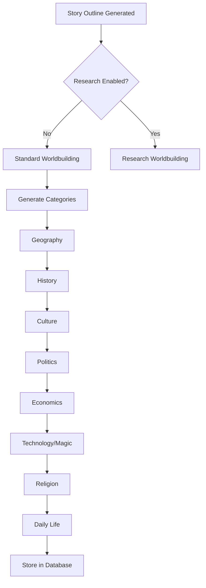
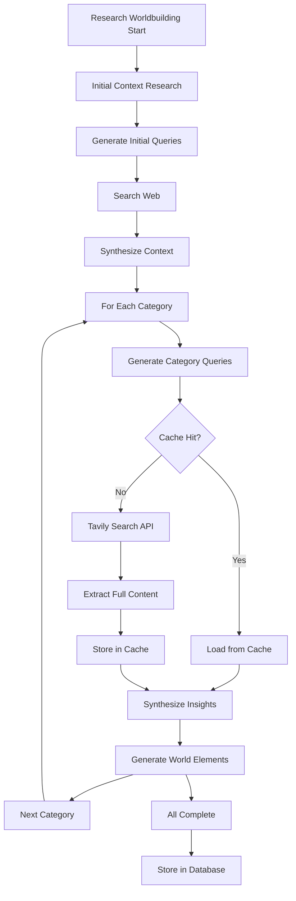
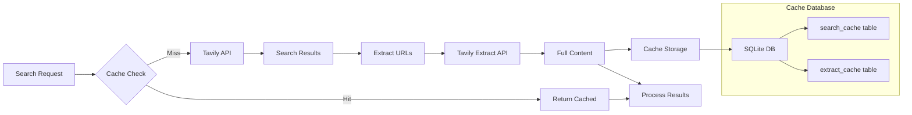
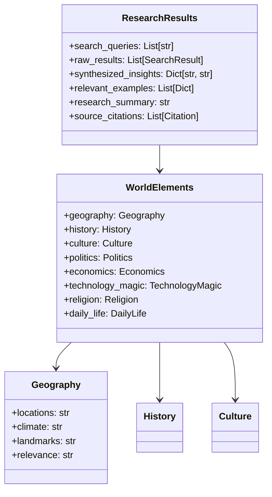
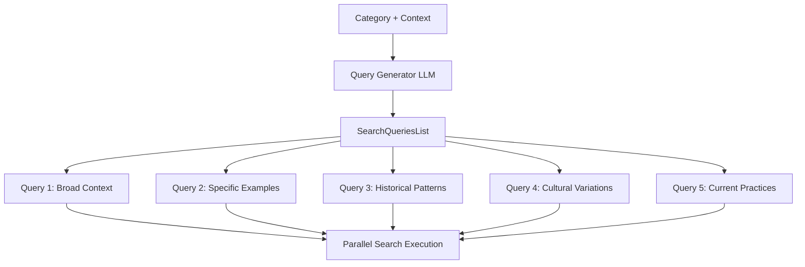

# Worldbuilding System Flow Diagram

## Standard Worldbuilding Flow

```mermaid
graph TD
    A[Story Outline Generated] --> B{Research Enabled?}
    B -->|No| C[Standard Worldbuilding]
    B -->|Yes| D[Research Worldbuilding]
    
    C --> E[Generate Categories]
    E --> F[Geography]
    F --> G[History]
    G --> H[Culture]
    H --> I[Politics]
    I --> J[Economics]
    J --> K[Technology/Magic]
    K --> L[Religion]
    L --> M[Daily Life]
    
    M --> N[Store in Database]
```

## Research-Enhanced Worldbuilding Flow

```mermaid
graph TD
    A[Research Worldbuilding Start] --> B[Initial Context Research]
    B --> C[Generate Initial Queries]
    C --> D[Search Web]
    D --> E[Synthesize Context]
    
    E --> F[For Each Category]
    F --> G[Generate Category Queries]
    G --> H{Cache Hit?}
    
    H -->|Yes| I[Load from Cache]
    H -->|No| J[Tavily Search API]
    J --> K[Extract Full Content]
    K --> L[Store in Cache]
    
    I --> M[Synthesize Insights]
    L --> M
    M --> N[Generate World Elements]
    N --> O[Next Category]
    O --> F
    
    N --> P[All Complete]
    P --> Q[Store in Database]
```

## Cache System Architecture

```mermaid
graph LR
    A[Search Request] --> B{Cache Check}
    B -->|Hit| C[Return Cached]
    B -->|Miss| D[Tavily API]
    
    D --> E[Search Results]
    E --> F[Extract URLs]
    F --> G[Tavily Extract API]
    G --> H[Full Content]
    
    H --> I[Cache Storage]
    I --> J[SQLite DB]
    
    C --> K[Process Results]
    H --> K
    
    subgraph "Cache Database"
        J --> L[search_cache table]
        J --> M[extract_cache table]
    end
```

## Data Structure

```mermaid
classDiagram
    class WorldElements {
        +geography: Geography
        +history: History
        +culture: Culture
        +politics: Politics
        +economics: Economics
        +technology_magic: TechnologyMagic
        +religion: Religion
        +daily_life: DailyLife
    }
    
    class Geography {
        +locations: str
        +climate: str
        +landmarks: str
        +relevance: str
    }
    
    class ResearchResults {
        +search_queries: List[str]
        +raw_results: List[SearchResult]
        +synthesized_insights: Dict[str, str]
        +relevant_examples: List[Dict]
        +research_summary: str
        +source_citations: List[Citation]
    }
    
    WorldElements --> Geography
    WorldElements --> History
    WorldElements --> Culture
    ResearchResults --> WorldElements
```

## Research Query Generation

```mermaid
graph TD
    A[Category + Context] --> B[Query Generator LLM]
    B --> C[SearchQueriesList]
    
    C --> D[Query 1: Broad Context]
    C --> E[Query 2: Specific Examples]
    C --> F[Query 3: Historical Patterns]
    C --> G[Query 4: Cultural Variations]
    C --> H[Query 5: Current Practices]
    
    D --> I[Parallel Search Execution]
    E --> I
    F --> I
    G --> I
    H --> I
```