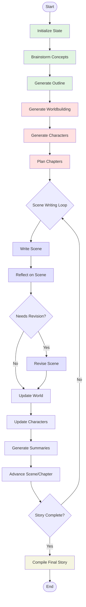

# StoryCraft Agent - Complete Story Generation Flow

## Overview

The StoryCraft Agent uses a LangGraph-based workflow to generate complete multi-chapter stories. The system follows a linear flow with conditional branching for scene revision, progressing through distinct phases from initialization to final compilation.

## Visual Flow Diagram



## High-Level Architecture

```
┌─────────────────┐     ┌──────────────┐     ┌───────────────┐
│   User Input    │────▶│  LangGraph   │────▶│    Output     │
│ (genre, tone,   │     │   Workflow   │     │ (story.md +   │
│  language, etc) │     │  (graph.py)  │     │  database)    │
└─────────────────┘     └──────────────┘     └───────────────┘
```

## Detailed Flow

### Phase 1: Initialization and Setup

#### 1. Initialize State (`initialize_state`)
- **Purpose**: Set up initial story parameters and configuration
- **Input**: User parameters (genre, tone, language, author, initial idea)
- **Process**:
  - Load configuration from database
  - Validate language support
  - Parse initial idea elements if provided
  - Set up author style guidance if author specified
- **Output**: Initial state with configuration

#### 2. Brainstorm Story Concepts (`brainstorm_story_concepts`)
- **Purpose**: Generate creative elements for the story
- **Process**:
  - If no initial idea: Generate unique story premises
  - Brainstorm story concepts (5 ideas)
  - Brainstorm world-building elements
  - Brainstorm central conflicts
  - Use LLM to evaluate and select best ideas
- **Output**: Creative elements stored in state

#### 3. Generate Story Outline (`generate_story_outline`)
- **Purpose**: Create the complete story structure
- **Process**:
  - Determine narrative structure (hero_journey, three_act, etc.)
  - Use structure-specific template (e.g., `story_outline_hero_journey.jinja2`)
  - Generate title, characters, conflict, setting, themes
  - Create phase-by-phase story progression
  - Extract initial plot threads
- **Output**: 
  - Complete story outline
  - Initial plot thread registry
  - Title stored in database

### Phase 2: World and Character Building

#### 4. Generate Worldbuilding (`generate_worldbuilding`)
- **Purpose**: Create detailed world elements
- **Process**:
  - Analyze genre requirements
  - Create locations, cultures, rules
  - Establish world-specific elements (magic systems, technology, etc.)
  - Ensure consistency with initial idea
- **Output**: World elements dictionary stored in state and database

#### 5. Generate Characters (`generate_characters`)
- **Purpose**: Create detailed character profiles
- **Process**:
  - Extract character requirements from outline
  - Generate 5-8 character profiles
  - Create personalities, backstories, motivations
  - Establish character relationships
  - Define character arcs
- **Output**: Character profiles stored in state and database

#### 6. Plan Chapters (`plan_chapters`)
- **Purpose**: Create detailed chapter-by-chapter plan
- **Process**:
  - Use narrative structure to determine chapter distribution
  - For each chapter:
    - Create title and summary (200-300 words)
    - Plan 3-6 scenes with:
      - Scene type (action, dialogue, exploration, etc.)
      - Plot progressions
      - Character developments
      - Tension levels
      - Connections between scenes
  - Establish pacing and dramatic flow
- **Output**: Complete chapter plan with scene specifications

### Phase 3: Scene Generation Loop

The system now enters a loop that continues until all scenes are written:

#### 7. Write Scene (`write_scene`)
- **Purpose**: Generate actual scene content
- **Process**:
  - Use intelligent instruction synthesis:
    - Generate book-level instructions (stored for reuse)
    - Generate scene-specific instructions
  - Combine all context in `scene_writing_intelligent` template
  - Generate 1500-2500 word scene
  - Store in database immediately
- **Output**: Scene content saved to database

#### 8. Reflect on Scene (`reflect_on_scene`)
- **Purpose**: Quality check the written scene
- **Process**: Simplified 4-metric analysis:
  - Overall quality (1-10)
  - Plot advancement check
  - Character consistency check
  - Prose engagement check
  - Identify critical issues only
- **Output**: Reflection results and revision decision

#### 9. Conditional: Revise Scene (`revise_scene_if_needed`)
- **Condition**: Only if critical issues identified
- **Process**:
  - Single revision pass
  - Focus on specific critical issues
  - Maintain scene requirements
  - Replace scene content in database
- **Output**: Revised scene content

#### 10. Update World Elements (`update_world_elements`)
- **Purpose**: Track new world information from scene
- **Process**:
  - Extract new locations, objects, rules
  - Update world element database
  - Maintain consistency
- **Output**: Updated world elements

#### 11. Update Character Profiles (`update_character_profiles`)
- **Purpose**: Track character development
- **Process**:
  - Extract character actions, dialogue, development
  - Update character knowledge tracking
  - Track relationship changes
  - Note character growth
- **Output**: Updated character profiles

#### 12. Generate Summaries (`generate_summaries`)
- **Purpose**: Create scene and chapter summaries
- **Process**:
  - Generate concise scene summary (2-3 sentences)
  - If chapter complete: Generate chapter summary
  - Update "what happened until now" context
  - Store in database for future reference
- **Output**: Summary data for context building

#### 13. Advance to Next Scene/Chapter (`advance_to_next_scene_or_chapter`)
- **Purpose**: Progress tracking and decision making
- **Process**:
  - Mark current scene as complete
  - Generate progress report
  - Determine next scene/chapter
  - Check if story is complete
- **Output**: Updated current_chapter and current_scene

#### 14. Conditional Branch: Continue or Complete
- **Condition Check** (`is_story_complete`):
  - If more scenes to write → Return to step 7
  - If all scenes complete → Continue to step 15

### Phase 4: Finalization

#### 15. Compile Final Story (`compile_final_story`)
- **Purpose**: Assemble the complete story
- **Process**:
  - Retrieve all scenes from database
  - Organize by chapter and scene order
  - Add chapter titles and formatting
  - Create table of contents
  - Generate metadata
- **Output**: Complete story in markdown format

## Key Components and Systems

### 1. Instruction Synthesis System
- **Book-level instructions**: Generated once, captures overall style, tone, themes
- **Scene-level instructions**: Generated per scene, includes:
  - What happened until now (summary context)
  - Specific scene requirements
  - Active plot threads
  - Character states and knowledge

### 2. Database Integration
- **SQLite database** stores:
  - Story configuration
  - Scene content
  - Character profiles
  - World elements
  - Summaries
  - Progress tracking

### 3. Template System
- **Multi-language support**: English and German templates
- **Structure-specific templates**: Different templates for each narrative structure
- **Intelligent templates**: Use LLM to synthesize instructions rather than concatenate data

### 4. Progress Tracking
- **Real-time updates**: Each node reports progress
- **Statistics tracking**: Word count, page estimates, completion percentage
- **Progress reports**: Generated after each scene/chapter

### 5. Quality Control
- **Reflection system**: Automated quality checks
- **Revision system**: Targeted fixes for critical issues only
- **Consistency tracking**: Plot threads, character knowledge, world rules

## Optimizations and Simplifications

1. **Removed scene brainstorming**: Integrated into writing process
2. **Simplified reflection**: Reduced from 9 metrics to 4 key checks
3. **Single-pass revision**: Maximum one revision per scene
4. **Intelligent instruction synthesis**: LLM creates coherent context instead of data dumps
5. **Conditional revision**: Only revise if critical issues present

## Configuration Options

- **Narrative structures**: hero_journey, three_act, kishotenketsu, in_medias_res, circular, nonlinear_mosaic
- **Languages**: English, German (full template support)
- **Recursion limit**: Configurable (default 200, increase for longer stories)
- **Target pages**: Automatically calculates chapters and scenes based on page target

## Error Handling

- **Partial story recovery**: Can recover incomplete stories from database
- **Progress persistence**: All content saved immediately to database
- **Graceful degradation**: Missing components use sensible defaults

## Scene Generation Deep Dive

### Instruction Synthesis Process

The system uses a two-level instruction synthesis approach:

1. **Book-Level Instructions** (generated once):
   - Synthesizes genre conventions, tone requirements, and author style
   - Creates coherent writing guidance for the entire book
   - Stored in database and reused for all scenes
   - Example: "Write in the whimsical, adventurous style of Terry Pratchett, with witty dialogue..."

2. **Scene-Level Instructions** (generated per scene):
   - Combines multiple context sources:
     - Scene requirements from chapter plan
     - "What happened until now" summary
     - Active plot threads
     - Character states and knowledge
     - Recent scene patterns to avoid
   - Uses LLM to create coherent instructions rather than concatenating data
   - Example: "Felix enters the archives seeking the ancient map. He's exhausted from the chase..."

### Context Building System

The `scene_context_builder.py` module creates comprehensive context by:

1. **Historical Context**:
   - Previous scene summaries (last 3-5 scenes)
   - Chapter summaries for context
   - Key events and revelations

2. **Character Context**:
   - Current emotional states
   - Knowledge tracking (what each character knows)
   - Recent character interactions
   - Arc progression status

3. **World Context**:
   - Active locations and their states
   - Established rules and systems
   - Recent world changes

4. **Plot Context**:
   - Active plot threads and their status
   - Required plot progressions for this scene
   - Foreshadowing elements

### Summary Generation

After each scene is finalized:

1. **Scene Summary** (2-3 sentences):
   - Key events and outcomes
   - Character developments
   - Plot progressions
   - Stored with timestamp

2. **Chapter Summary** (when chapter completes):
   - Major chapter events
   - Character arc progress
   - Plot thread developments
   - Thematic elements explored

These summaries feed back into the context for future scenes.

## Database Schema

Key tables in the SQLite database:

1. **story_config**: Story metadata and configuration
2. **scenes**: Scene content and metadata
3. **characters**: Character profiles and development
4. **world_elements**: Locations, objects, rules
5. **summaries**: Scene and chapter summaries
6. **plot_threads**: Plot thread tracking
7. **character_knowledge**: What each character knows
8. **scene_structures**: Pattern tracking for variety

## Template Organization

```
templates/
├── base/                    # English templates
│   ├── scene_writing_intelligent.jinja2
│   ├── reflect_scene_intelligent.jinja2
│   ├── synthesize_book_instructions.jinja2
│   ├── synthesize_scene_instructions.jinja2
│   └── story_outline_[structure].jinja2
└── languages/
    └── german/             # German translations
        └── [same structure as base]
```

## Performance Considerations

1. **Memory Management**:
   - State pruning after each chapter
   - Summary-based context compression
   - Database storage for large content

2. **LLM Optimization**:
   - Structured output for consistency
   - Template-based prompts for efficiency
   - Intelligent context selection

3. **Progress Tracking**:
   - Real-time updates via callback system
   - Efficient database queries
   - Cached statistics